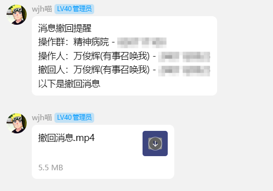
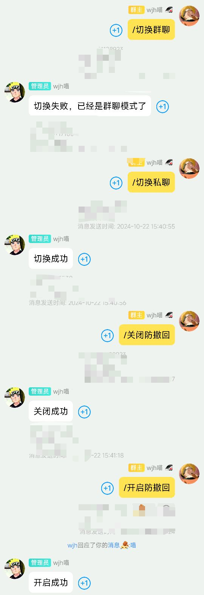
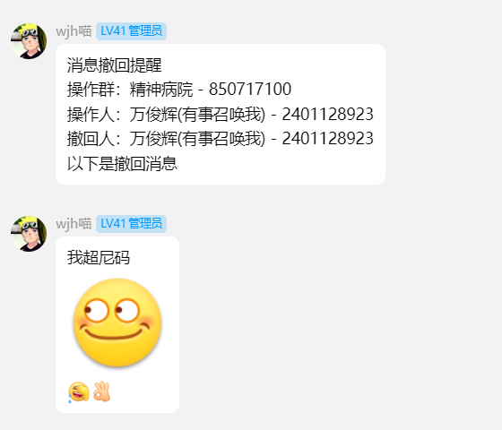
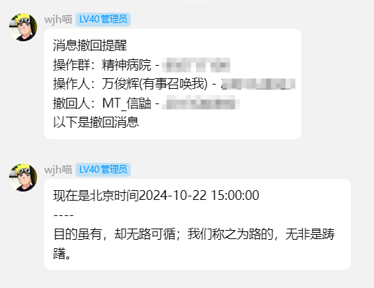

  
   
  

# nonebot-prevent-withdrawal
_✨ 防撤回插件 ✨_

## 📖 介绍

- 本插件支持多个消息段撤回监听，但是仅支持群聊，目前只支持**Lagrange.OneBot**，因为根据群友的消息~~llonebot和NapCat似乎视频消息不返回网络URL~~，此项目有些奇怪的BUG，例如~~黄豆表情无法显示~~（Lagrange已修复）、超级表情会显示表情和文字等

- 装了此插件后debug级别的日志下会疯狂输出`Running PreProcessors...`，这个作者也没办法，是NoneBot的预处理钩子干的，修不了，~~其实只要开INFO级别的日志就行了，而一般用户默认是INFO级别的日志~~

使用方法请参考[这里](#-使用)

> [!WARNING]
> 私聊模式**不支持**发送撤回的视频消息，因为Lagrange.OneBot的私聊消息有BUG

> [!WARNING]
> 本插件不支持监听撤回的文件，而且由于某些BUG似乎无法发送提示文本

## 💿 安装

使用 nb-cli 安装

在 nonebot2 项目的根目录下打开命令行, 输入以下指令即可安装

    nb plugin install nonebot-prevent-withdrawal

使用包管理器安装

在 nonebot2 项目的插件目录下, 打开命令行, 根据你使用的包管理器, 输入相应的安装命令

pip

    pip install nonebot-prevent-withdrawal

pdm

    pdm add nonebot-prevent-withdrawal

poetry

    poetry add nonebot-prevent-withdrawal

conda

    conda install nonebot-prevent-withdrawal

打开 nonebot2 项目根目录下的 `pyproject.toml` 文件, 在 `[tool.nonebot]` 部分追加写入

    plugins = ["nonebot-prevent-withdrawal"]

## 🎉 使用
### 指令表
| 指令 | 权限 | 需要@ | 范围 | 说明 |
|:-----:|:----:|:----:|:----:|:----:|
| 开启/关闭防撤回 | 主人 | 否 | 群聊 | 必须先开启才能用 |
| 切换私聊/群聊 | 主人 | 否 | 通用 | 发送到哪里 |
| 添加群/删除群 | 主人 | 否 | 群聊 | 指定发送的群聊 |
| 加白/删白 [@/输入QQ号] | 主人 | 否 | 通用 | 排除某人的撤回消息 |
| 排除管理 | 主人 | 否 | 通用 | 排除管理和群主的消息 |
| 取消排除 | 主人 | 否 | 通用 | 取消排除管理和群主的消息 |

### 效果图

点击展开

## ❤️感谢以下项目提供支持
[NoneBot](https://github.com/nonebot/nonebot2)

[Lagrange](https://github.com/LagrangeDev/Lagrange.Core)

[~~疑似小南梁的群友~~](https://ys.mihoyo.com/?utm_source=backup53&from_channel=backup53&msclkid=0c6ba0c279c51d4b80b6c7d51cd912bd#/)

[GITHUB](https://github.com)